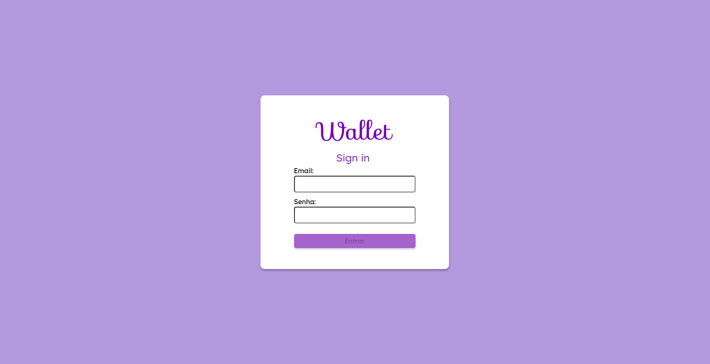
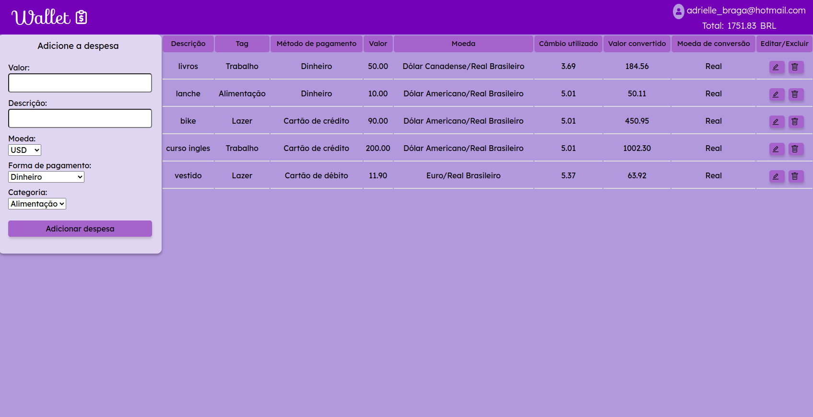

# Projeto Wallet Trybe

Esse é um projeto de carteira digital que registra despesas em outras moedas e os valores são convertidos e totalizados em real.

Foi desenvolvido funcionalidades de editar e excluir qualquer despesa listada na tabela.

Para contrução, usei a api de cotações e pratiquei conhecimentos em React js, Routes, Redux, Testes e CSS.

  

